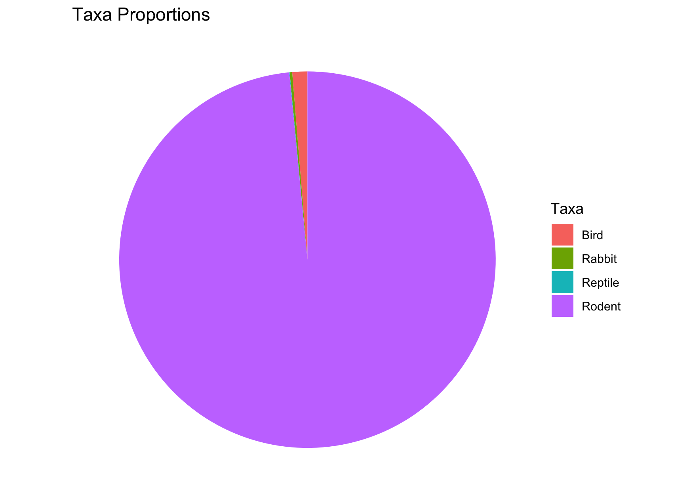
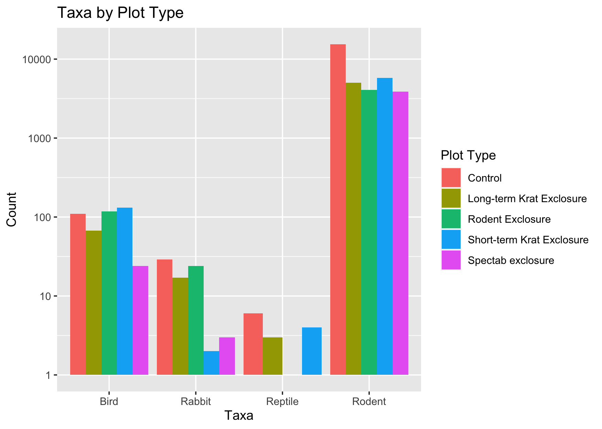
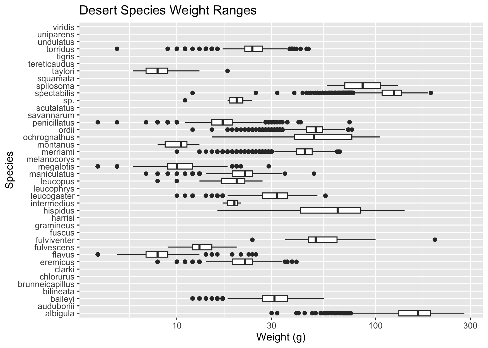
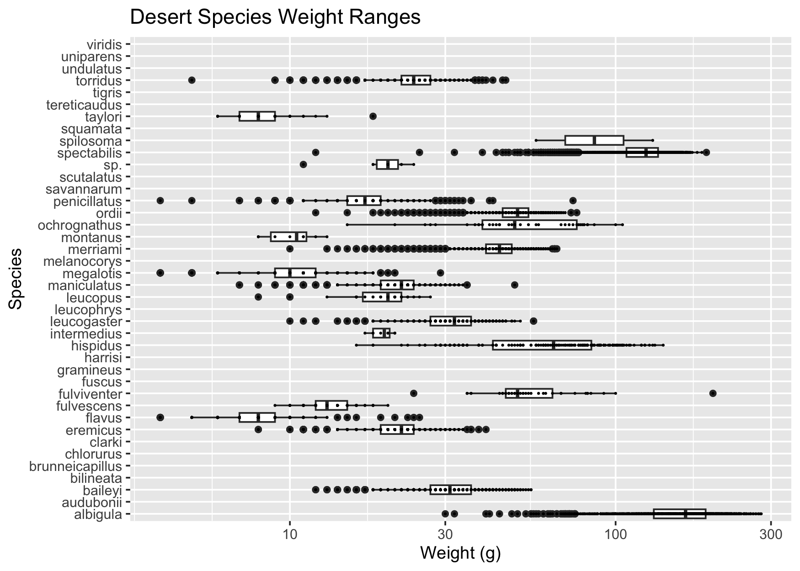
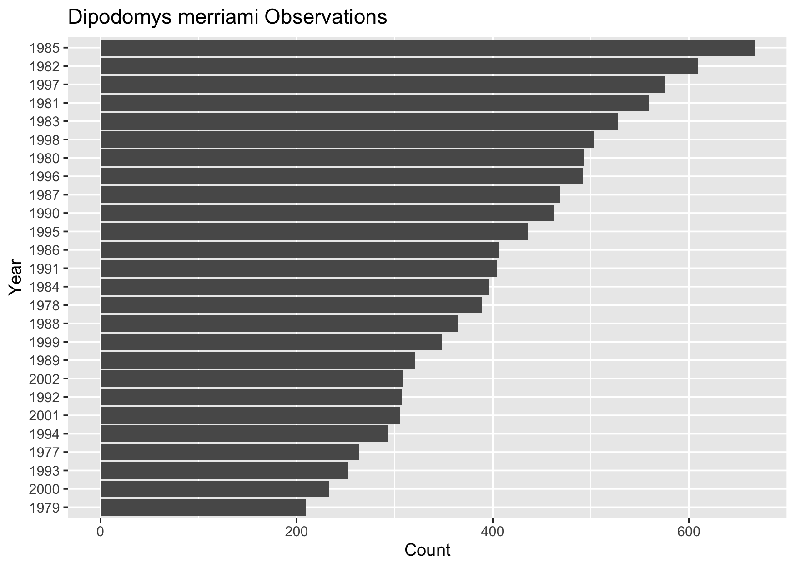
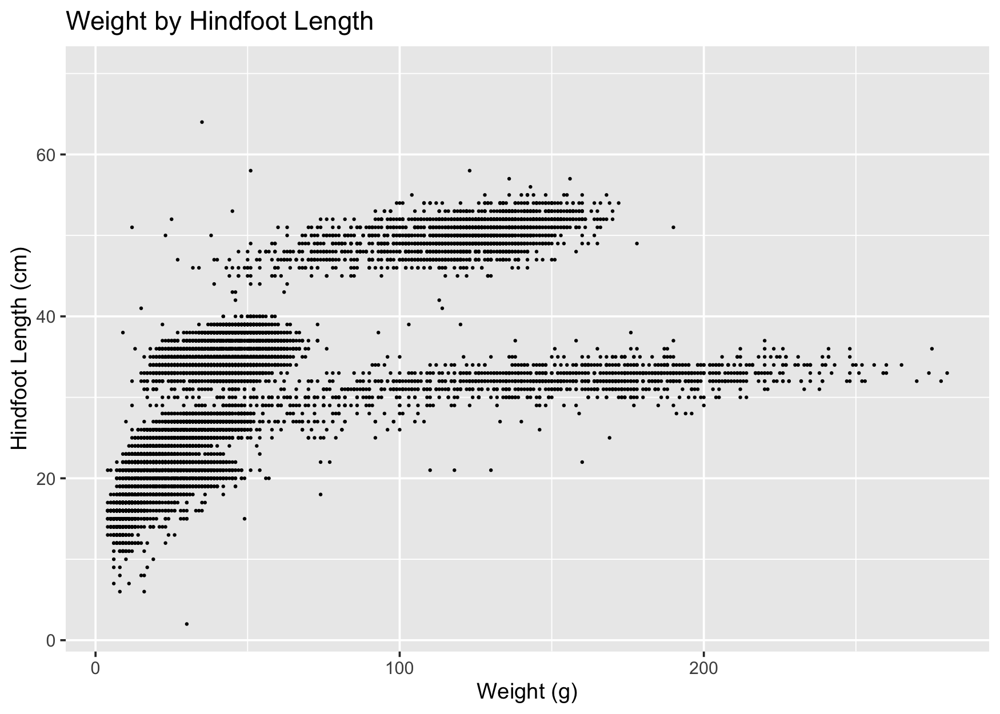
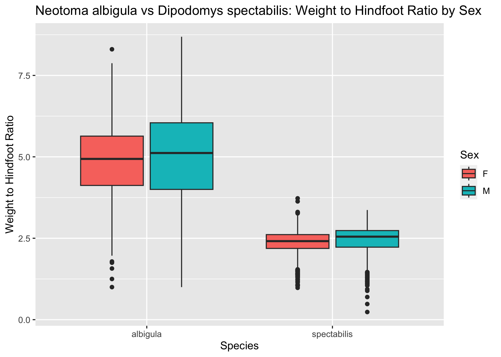
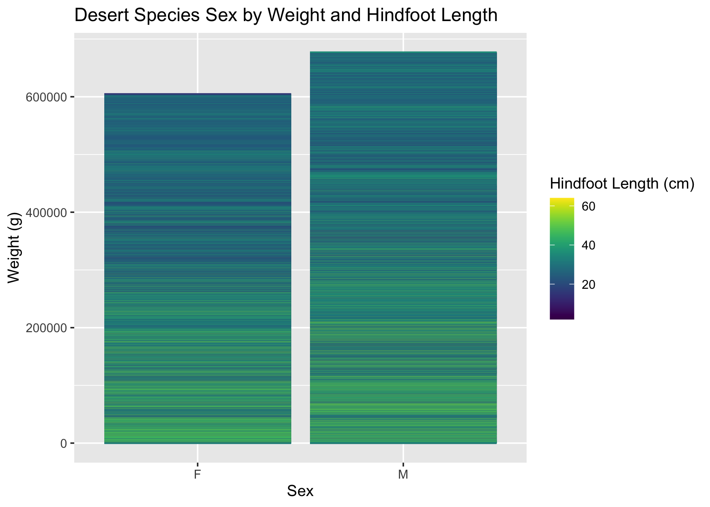

## Instructions
Answer the following questions and complete the exercises in RMarkdown. Please embed all of your code and push your final work to your repository. Your final lab report should be organized, clean, and run free from errors. Remember, you must remove the `#` for the included code chunks to run. Be sure to add your name to the author header above. For any included plots, make sure they are clearly labeled. You are free to use any plot type that you feel best communicates the results of your analysis.  

Make sure to use the formatting conventions of RMarkdown to make your report neat and clean!  

## Load the libraries

```r
library(tidyverse)
library(janitor)
library(naniar)
library(viridis)
```


```r
options(scipen=999)#cancels scientific notation for the session
```

## Desert Ecology
For this assignment, we are going to use a modified data set on [desert ecology](http://esapubs.org/archive/ecol/E090/118/). The data are from: S. K. Morgan Ernest, Thomas J. Valone, and James H. Brown. 2009. Long-term monitoring and experimental manipulation of a Chihuahuan Desert ecosystem near Portal, Arizona, USA. Ecology 90:1708.

```r
deserts <- read_csv("data/surveys_complete.csv") %>% clean_names()
```

```
## Rows: 34786 Columns: 13
## ── Column specification ────────────────────────────────────────────────────────
## Delimiter: ","
## chr (6): species_id, sex, genus, species, taxa, plot_type
## dbl (7): record_id, month, day, year, plot_id, hindfoot_length, weight
## 
## ℹ Use `spec()` to retrieve the full column specification for this data.
## ℹ Specify the column types or set `show_col_types = FALSE` to quiet this message.
```

1. Use the function(s) of your choice to get an idea of its structure, including how NA's are treated. Are the data tidy?  

```r
glimpse(deserts)
```

```
## Rows: 34,786
## Columns: 13
## $ record_id       <dbl> 1, 2, 3, 4, 5, 6, 7, 8, 9, 10, 11, 12, 13, 14, 15, 16,…
## $ month           <dbl> 7, 7, 7, 7, 7, 7, 7, 7, 7, 7, 7, 7, 7, 7, 7, 7, 7, 7, …
## $ day             <dbl> 16, 16, 16, 16, 16, 16, 16, 16, 16, 16, 16, 16, 16, 16…
## $ year            <dbl> 1977, 1977, 1977, 1977, 1977, 1977, 1977, 1977, 1977, …
## $ plot_id         <dbl> 2, 3, 2, 7, 3, 1, 2, 1, 1, 6, 5, 7, 3, 8, 6, 4, 3, 2, …
## $ species_id      <chr> "NL", "NL", "DM", "DM", "DM", "PF", "PE", "DM", "DM", …
## $ sex             <chr> "M", "M", "F", "M", "M", "M", "F", "M", "F", "F", "F",…
## $ hindfoot_length <dbl> 32, 33, 37, 36, 35, 14, NA, 37, 34, 20, 53, 38, 35, NA…
## $ weight          <dbl> NA, NA, NA, NA, NA, NA, NA, NA, NA, NA, NA, NA, NA, NA…
## $ genus           <chr> "Neotoma", "Neotoma", "Dipodomys", "Dipodomys", "Dipod…
## $ species         <chr> "albigula", "albigula", "merriami", "merriami", "merri…
## $ taxa            <chr> "Rodent", "Rodent", "Rodent", "Rodent", "Rodent", "Rod…
## $ plot_type       <chr> "Control", "Long-term Krat Exclosure", "Control", "Rod…
```

#### NAs are treated as `NA` and the data are tidy.

2. How many genera and species are represented in the data? What are the total number of observations? Which species is most/least frequently sampled in the study?

```r
deserts %>% 
  summarise(n_genera = n_distinct(genus),
            n_species = n_distinct(species),
            n_total = n())
```

```
## # A tibble: 1 × 3
##   n_genera n_species n_total
##      <int>     <int>   <int>
## 1       26        40   34786
```


```r
deserts %>% 
  group_by(species) %>% 
  summarise(n_total = n()) %>% 
  arrange(desc(n_total))
```

```
## # A tibble: 40 × 2
##    species      n_total
##    <chr>          <int>
##  1 merriami       10596
##  2 penicillatus    3123
##  3 ordii           3027
##  4 baileyi         2891
##  5 megalotis       2609
##  6 spectabilis     2504
##  7 torridus        2249
##  8 flavus          1597
##  9 eremicus        1299
## 10 albigula        1252
## # ℹ 30 more rows
```

#### merriami are sampled the most and clarki, scutalatus, tereticaudus, tigris, uniparens, and viridis are sampled the least

3. What is the proportion of taxa included in this study? Show a table and plot that reflects this count.

```r
tabyl(deserts$taxa)
```

```
##  deserts$taxa     n      percent
##          Bird   450 0.0129362387
##        Rabbit    75 0.0021560398
##       Reptile    14 0.0004024608
##        Rodent 34247 0.9845052607
```


```r
deserts %>% 
  ggplot(aes(x = "", fill = taxa)) +
  geom_bar(width = 1) + 
  coord_polar("y") +
  theme_void() +
  labs(title = "Taxa Proportions",
       fill = "Taxa")
```



4. For the taxa included in the study, use the fill option to show the proportion of individuals sampled by `plot_type.`

```r
deserts %>% 
  ggplot(aes(x = taxa, fill = plot_type)) +
  geom_bar(position= "dodge") +
  scale_y_log10() +
  labs(title = "Taxa by Plot Type",
       x = "Taxa",
       y = "Count",
       fill = "Plot Type")
```



5. What is the range of weight for each species included in the study? Remove any observations of weight that are NA so they do not show up in the plot.

```r
deserts %>% 
  ggplot(aes(x = weight, y = species)) +
  geom_boxplot(na.rm = T) + 
  scale_x_log10() +
  labs(title = "Desert Species Weight Ranges",
       x = "Weight (g)",
       y = "Species")
```



6. Add another layer to your answer from #5 using `geom_point` to get an idea of how many measurements were taken for each species.

```r
deserts %>% 
  ggplot(aes(x = weight, y = species)) +
  geom_boxplot(na.rm = T) +
  scale_x_log10() +
  labs(title = "Desert Species Weight Ranges",
       x = "Weight (g)",
       y = "Species")+
  geom_point(size = .2)
```

```
## Warning: Removed 2503 rows containing missing values (`geom_point()`).
```



7. [Dipodomys merriami](https://en.wikipedia.org/wiki/Merriam's_kangaroo_rat) is the most frequently sampled animal in the study. How have the number of observations of this species changed over the years included in the study?

```r
deserts %>% 
  filter(species == "merriami") %>% 
  count(year) %>% 
  ggplot(aes(x = reorder(year, n), y = n)) +
  coord_flip() +
  geom_col() +
  labs(title = "Dipodomys merriami Observations",
       x = "Year",
       y = "Count")
```



8. What is the relationship between `weight` and `hindfoot` length? Consider whether or not over plotting is an issue.

```r
deserts %>% 
  ggplot(aes(x = weight, y = hindfoot_length)) +
  geom_point(size = .2) +
  labs(title = "Weight by Hindfoot Length",
       x = "Weight (g)",
       y = "Hindfoot Length (cm)")
```

```
## Warning: Removed 4048 rows containing missing values (`geom_point()`).
```



#### Over plotting is an issue here but `geom_jitter` did not help so I made the points smaller.

9. Which two species have, on average, the highest weight? Once you have identified them, make a new column that is a ratio of `weight` to `hindfoot_length`. Make a plot that shows the range of this new ratio and fill by sex.

```r
deserts %>% 
  group_by(genus, species) %>% 
  summarise(mean_weight = mean(weight, na.rm = T)) %>% 
  arrange(desc(mean_weight))
```

```
## `summarise()` has grouped output by 'genus'. You can override using the
## `.groups` argument.
```

```
## # A tibble: 48 × 3
## # Groups:   genus [26]
##    genus        species      mean_weight
##    <chr>        <chr>              <dbl>
##  1 Neotoma      albigula           159. 
##  2 Dipodomys    spectabilis        120. 
##  3 Spermophilus spilosoma           93.5
##  4 Sigmodon     hispidus            73.1
##  5 Sigmodon     fulviventer         58.9
##  6 Sigmodon     ochrognathus        55.4
##  7 Dipodomys    ordii               48.9
##  8 Dipodomys    merriami            43.2
##  9 Chaetodipus  baileyi             31.7
## 10 Onychomys    leucogaster         31.6
## # ℹ 38 more rows
```


```r
deserts %>% 
  filter(genus == "Neotoma" | genus == "Dipodomys") %>% 
  filter(species == "albigula" | species == "spectabilis") %>% 
  filter(weight != "NA") %>% 
  filter(hindfoot_length != "NA") %>% 
  filter(sex != "NA") %>% 
  mutate(weight_hindfoot_ratio = weight/hindfoot_length) %>% 
  ggplot(aes(x = species, y = weight_hindfoot_ratio, fill = sex)) +
  geom_boxplot() +
  labs(title = "Neotoma albigula vs Dipodomys spectabilis: Weight to Hindfoot Ratio by Sex",
       x = "Species",
       y = "Weight to Hindfoot Ratio",
       fill = "Sex")
```




10. Make one plot of your choice! Make sure to include at least two of the aesthetics options you have learned.

```r
deserts %>% 
  filter(sex != "NA") %>% 
  filter(weight != "NA") %>% 
  filter(hindfoot_length != "NA") %>% 
  ggplot(aes(x = sex, y = weight)) +
  geom_col(aes(color = hindfoot_length)) +
  scale_color_viridis(name = "Hindfoot Length (cm)")+
  labs(title = "Desert Species Sex by Weight and Hindfoot Length",
       x = "Sex",
       y = "Weight (g)")
```



## Push your final code to GitHub!
Please be sure that you check the `keep md` file in the knit preferences. 
