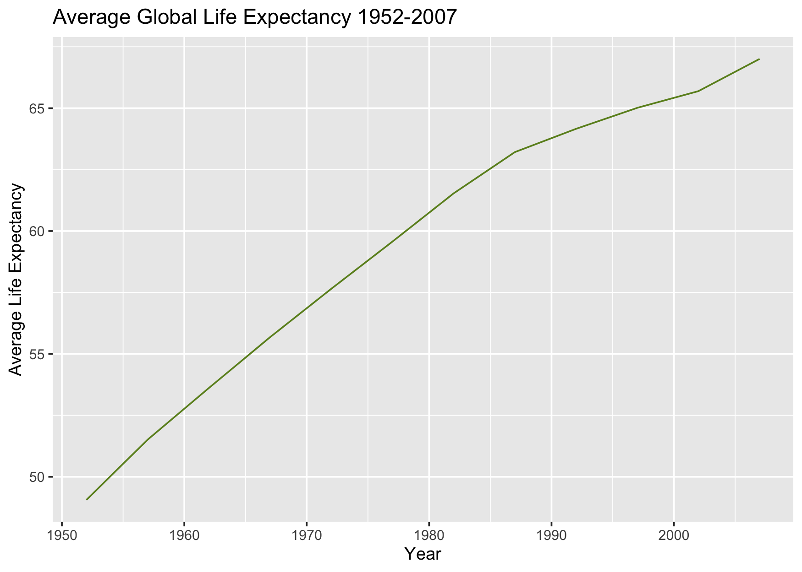
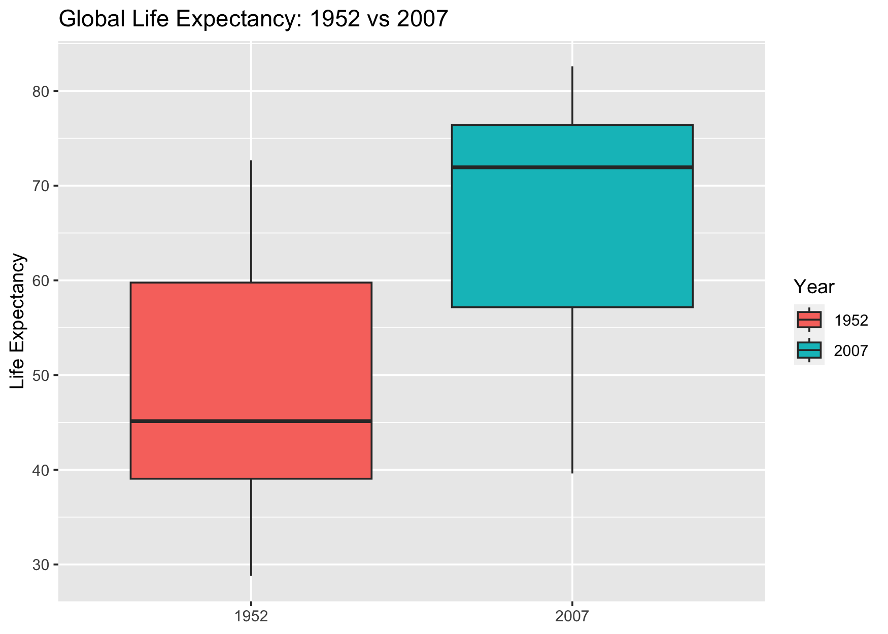
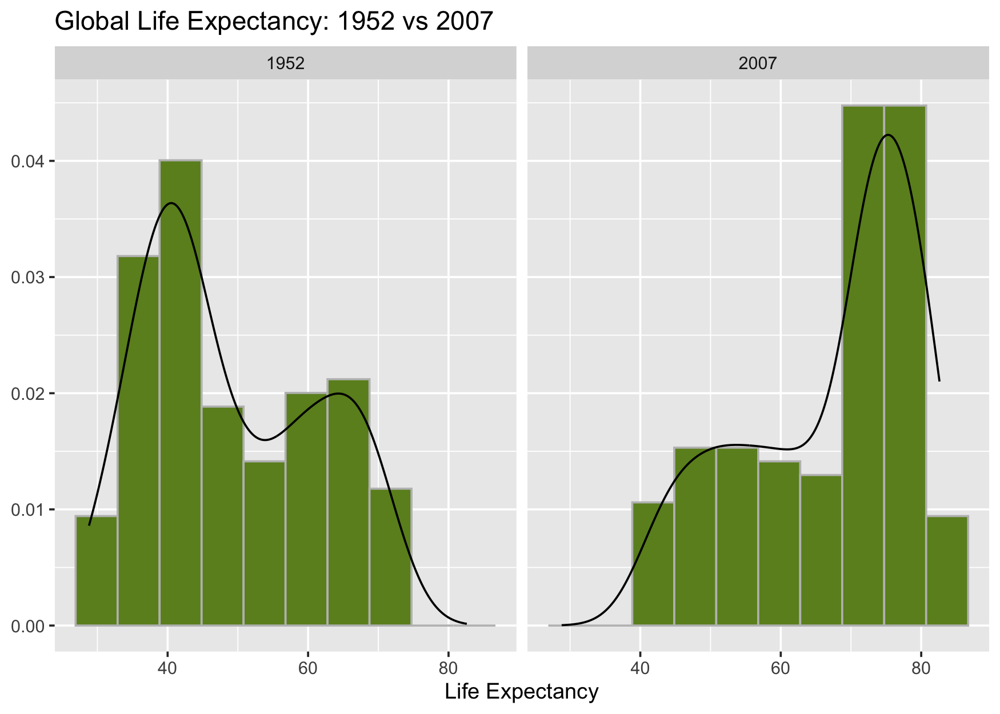
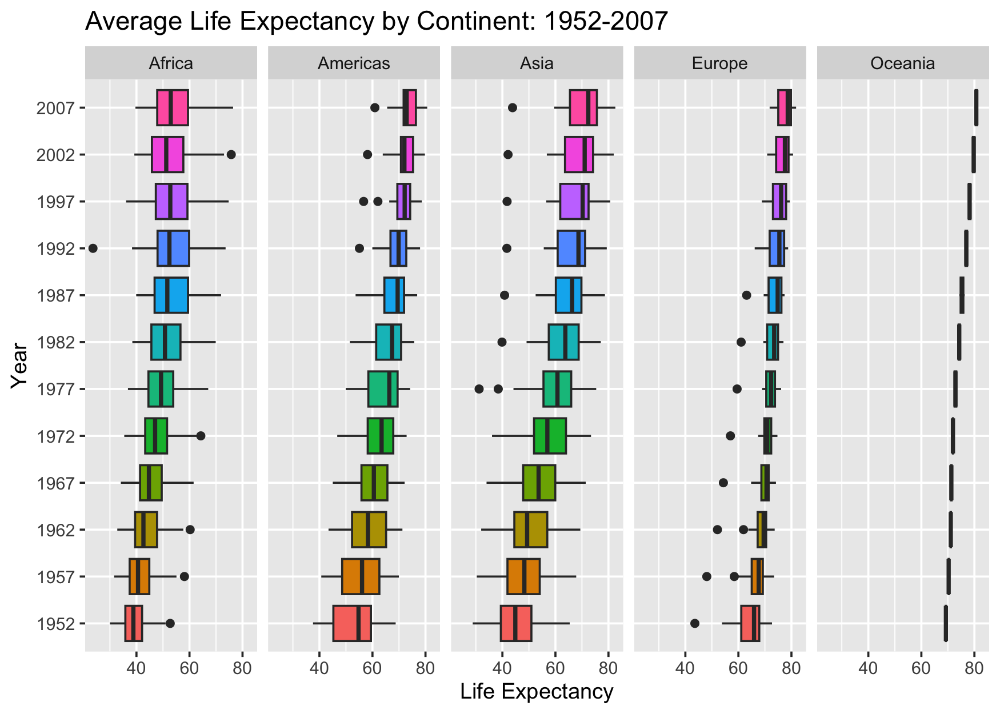
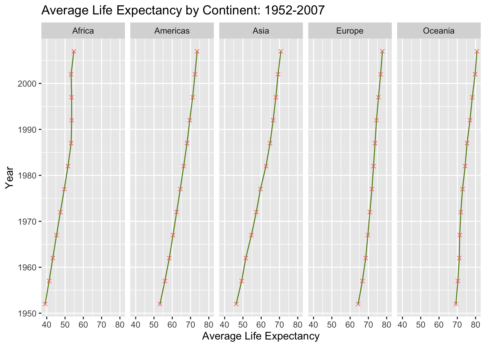
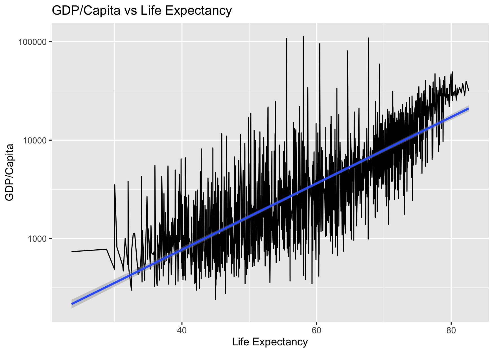
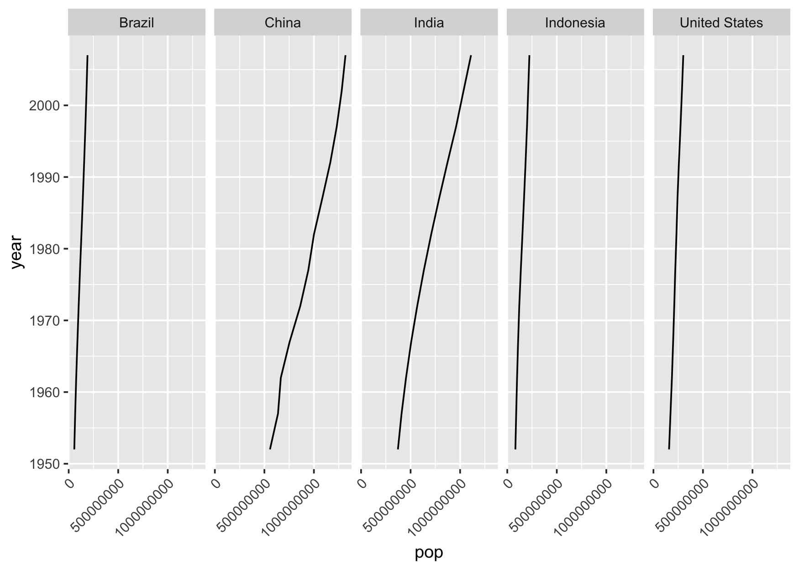
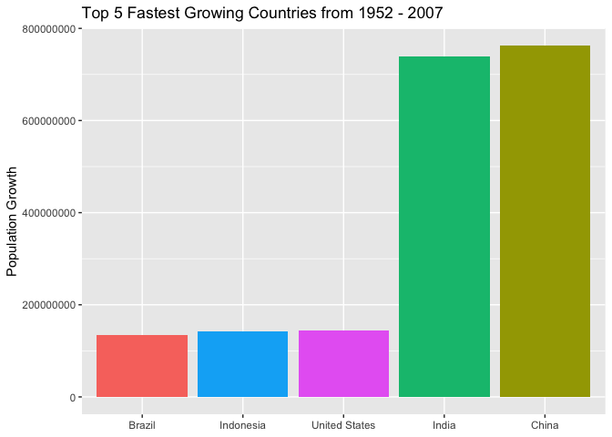
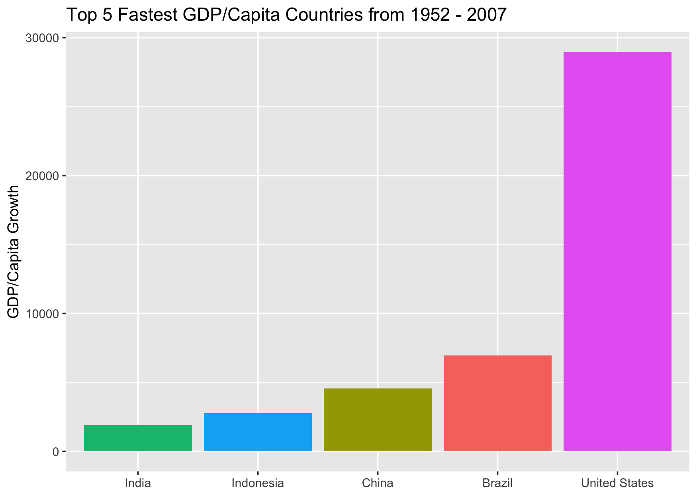
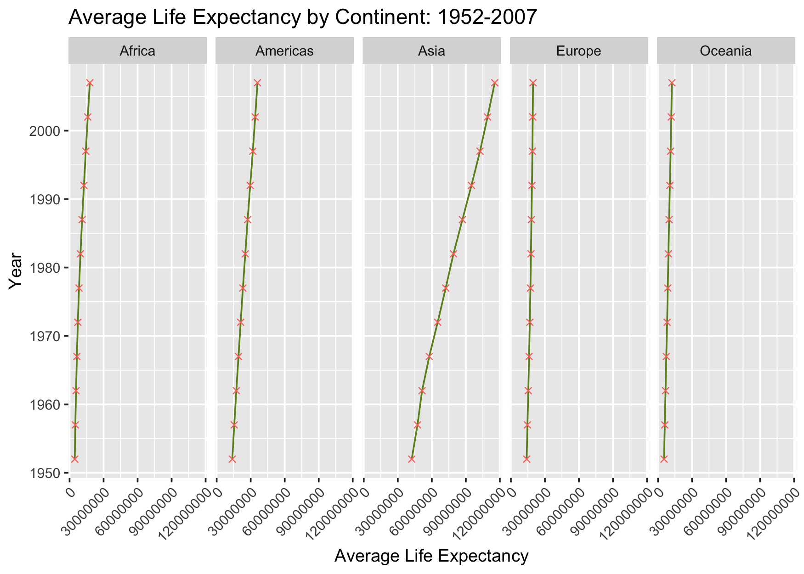

## Instructions
Answer the following questions and complete the exercises in RMarkdown. Please embed all of your code and push your final work to your repository. Your final lab report should be organized, clean, and run free from errors. Remember, you must remove the `#` for the included code chunks to run. Be sure to add your name to the author header above. For any included plots, make sure they are clearly labeled. You are free to use any plot type that you feel best communicates the results of your analysis.  

**In this homework, you should make use of the aesthetics you have learned. It's OK to be flashy!**

Make sure to use the formatting conventions of RMarkdown to make your report neat and clean!  

## Load the libraries

```r
library(tidyverse)
library(janitor)
library(here)
library(naniar)
```


```r
options(scipen = 999)
```

## Resources
The idea for this assignment came from [Rebecca Barter's](http://www.rebeccabarter.com/blog/2017-11-17-ggplot2_tutorial/) ggplot tutorial so if you get stuck this is a good place to have a look.  

## Gapminder
For this assignment, we are going to use the dataset [gapminder](https://cran.r-project.org/web/packages/gapminder/index.html). Gapminder includes information about economics, population, and life expectancy from countries all over the world. You will need to install it before use. This is the same data that we will use for midterm 2 so this is good practice.

```r
# install.packages("gapminder")
library("gapminder")
```

## Questions
The questions below are open-ended and have many possible solutions. Your approach should, where appropriate, include numerical summaries and visuals. Be creative; assume you are building an analysis that you would ultimately present to an audience of stakeholders. Feel free to try out different `geoms` if they more clearly present your results.  

**1. Use the function(s) of your choice to get an idea of the overall structure of the data frame, including its dimensions, column names, variable classes, etc. As part of this, determine how NAs are treated in the data.**  

```r
gapminder <- gapminder
glimpse(gapminder)
```

```
## Rows: 1,704
## Columns: 6
## $ country   <fct> "Afghanistan", "Afghanistan", "Afghanistan", "Afghanistan", …
## $ continent <fct> Asia, Asia, Asia, Asia, Asia, Asia, Asia, Asia, Asia, Asia, …
## $ year      <int> 1952, 1957, 1962, 1967, 1972, 1977, 1982, 1987, 1992, 1997, …
## $ lifeExp   <dbl> 28.801, 30.332, 31.997, 34.020, 36.088, 38.438, 39.854, 40.8…
## $ pop       <int> 8425333, 9240934, 10267083, 11537966, 13079460, 14880372, 12…
## $ gdpPercap <dbl> 779.4453, 820.8530, 853.1007, 836.1971, 739.9811, 786.1134, …
```

```r
gapminder %>% 
  map_df(~ sum(is.na(.)))
```

```
## # A tibble: 1 × 6
##   country continent  year lifeExp   pop gdpPercap
##     <int>     <int> <int>   <int> <int>     <int>
## 1       0         0     0       0     0         0
```

#### From what I can tell, there are no NA values in this dataset

**2. Among the interesting variables in gapminder is life expectancy. How has global life expectancy changed between 1952 and 2007?**

```r
gapminder %>% 
  group_by(year) %>%
  summarise(mean_life_exp = mean(lifeExp)) %>% 
  ggplot(aes(x = year, y = mean_life_exp)) +
  geom_line(color = "olivedrab") +
  labs(title = "Average Global Life Expectancy 1952-2007",
       x = "Year",
       y = "Average Life Expectancy")
```



**3. How do the distributions of life expectancy compare for the years 1952 and 2007?**

```r
gapminder %>% 
  mutate(year = as.factor(year)) %>% 
  filter(year == 1952 | year == 2007) %>% 
  ggplot(aes(x = year, y = lifeExp, fill = year)) +
  geom_boxplot() +
  labs(title = "Global Life Expectancy: 1952 vs 2007",
       x = NULL,
       y = "Life Expectancy",
       fill = "Year")
```




```r
gapminder %>% 
  filter(year == 1952 | year == 2007) %>% 
  ggplot(aes(y = lifeExp))+
  facet_grid(.~year) +
  geom_histogram(aes(after_stat(density)), bins = 10, color = "grey", fill = "olivedrab") +
  geom_density() +
  coord_flip() +
  labs(title = "Global Life Expectancy: 1952 vs 2007",
       x = NULL,
       y = "Life Expectancy")
```



**4. Your answer above doesn't tell the whole story since life expectancy varies by region. Make a summary that shows the min, mean, and max life expectancy by continent for all years represented in the data.**

```r
gapminder %>% 
  mutate(year = as.factor(year)) %>% 
  group_by(year) %>% 
  ggplot(aes(x = lifeExp, y = year, fill = year)) + 
  facet_grid(.~continent) + 
  geom_boxplot() +
  guides(fill = FALSE) +
  labs(title = "Average Life Expectancy by Continent: 1952-2007",
       x = "Life Expectancy",
       y = "Year")
```

```
## Warning: The `<scale>` argument of `guides()` cannot be `FALSE`. Use "none" instead as
## of ggplot2 3.3.4.
## This warning is displayed once every 8 hours.
## Call `lifecycle::last_lifecycle_warnings()` to see where this warning was
## generated.
```



**5. How has life expectancy changed between 1952-2007 for each continent?**

```r
gapminder %>% 
  group_by(continent, year) %>%
  summarise(mean_life_exp = mean(lifeExp)) %>% 
  ggplot(aes(x = year, y = mean_life_exp)) +
  geom_line(color = "olivedrab") +
  geom_point(aes(color = "lightpink"), shape = 4) +
  facet_grid(.~continent) +
  coord_flip() +
  guides(color = FALSE) +
  labs(title = "Average Life Expectancy by Continent: 1952-2007",
       x = "Year",
       y = "Average Life Expectancy")
```

```
## `summarise()` has grouped output by 'continent'. You can override using the
## `.groups` argument.
```



**6. We are interested in the relationship between per capita GDP and life expectancy; i.e. does having more money help you live longer?**

```r
gapminder %>%
  ggplot(aes(x = lifeExp, y = gdpPercap)) +
  scale_y_log10() +
  geom_line() +
  geom_smooth(method = lm, se = T) +
  labs(title = "GDP/Capita vs Life Expectancy",
       x = "Life Expectancy",
       y = "GDP/Capita")
```

```
## `geom_smooth()` using formula = 'y ~ x'
```



**7. Which countries have had the largest population growth since 1952?**

```r
gapminder %>% 
  group_by(country) %>% 
  summarise(max = max(pop),
            min = min(pop)) %>%
  mutate(growth = max-min) %>% 
  arrange(desc(growth))
```

```
## # A tibble: 142 × 4
##    country              max       min    growth
##    <fct>              <int>     <int>     <int>
##  1 China         1318683096 556263527 762419569
##  2 India         1110396331 372000000 738396331
##  3 United States  301139947 157553000 143586947
##  4 Indonesia      223547000  82052000 141495000
##  5 Brazil         190010647  56602560 133408087
##  6 Pakistan       169270617  41346560 127924057
##  7 Bangladesh     150448339  46886859 103561480
##  8 Nigeria        135031164  33119096 101912068
##  9 Mexico         108700891  30144317  78556574
## 10 Philippines     91077287  22438691  68638596
## # ℹ 132 more rows
```

#### China, India, America, Indonesia, and Brazil have the had the largest population growth since 1952.

**8. Use your results from the question above to plot population growth for the top five countries since 1952.**

```r
gapminder %>% 
  filter(country == "China" | country == "India" | country == "United States" | country == "Indonesia" | country == "Brazil") %>% 
  ggplot(aes(x = year, y = pop)) +
  geom_line() +
  facet_grid(.~country) +
  coord_flip() +
  theme(axis.text.x = element_text(angle = 45, hjust=1))
```




```r
gapminder %>% 
  group_by(country) %>% 
  summarise(max = max(pop),
            min = min(pop)) %>%
  mutate(growth = max-min) %>%
  filter(country == "China" | country == "India" | country == "United States" | country == "Indonesia" | country == "Brazil") %>% 
  ggplot(aes(x = reorder(country, growth), y = growth, fill = country)) +
  geom_col() +
  guides(fill = FALSE) +
  labs(title = "Top 5 Fastest Growing Countries from 1952 - 2007",
       x = NULL,
       y = "Population Growth")
```

<!-- -->

**9. How does per capita GDP growth compare between these same five countries?**

```r
gapminder %>% 
  group_by(country) %>% 
  summarise(max = max(gdpPercap),
            min = min(gdpPercap)) %>%
  mutate(growth = max-min) %>%
  filter(country == "China" | country == "India" | country == "United States" | country == "Indonesia" | country == "Brazil") %>% 
  ggplot(aes(x = reorder(country, growth), y = growth, fill = country)) +
  geom_col() +
  guides(fill = FALSE) +
  labs(title = "Top 5 Fastest GDP/Capita Countries from 1952 - 2007",
       x = NULL,
       y = "GDP/Capita Growth")
```



**10. Make one plot of your choice that uses faceting!**

```r
gapminder %>% 
  group_by(continent, year) %>%
  summarise(mean_pop = mean(pop), .groups = "keep") %>% 
  ggplot(aes(x = year, y = mean_pop)) +
  geom_line(color = "olivedrab") +
  geom_point(aes(color = "lightpink"), shape = 4) +
  facet_grid(.~continent) +
  guides(color = FALSE) +
  coord_flip() +
  theme(axis.text.x = element_text(angle = 45, hjust=1)) +
  labs(title = "Average Life Expectancy by Continent: 1952-2007",
       x = "Year",
       y = "Average Life Expectancy")
```



## Push your final code to GitHub!
Please be sure that you check the `keep md` file in the knit preferences. 
