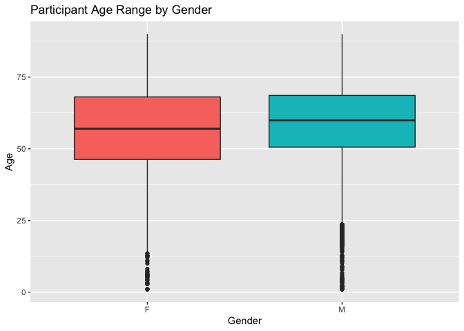

## Instructions
Answer the following questions and complete the exercises in RMarkdown. Please embed all of your code and push your final work to your repository. Your code should be organized, clean, and run free from errors. Remember, you must remove the `#` for any included code chunks to run. Be sure to add your name to the author header above.  

Make sure to use the formatting conventions of RMarkdown to make your report neat and clean! Use the tidyverse and pipes unless otherwise indicated. To receive full credit, all plots must have clearly labeled axes, a title, and consistent aesthetics. This exam is worth a total of 35 points. 

Please load the following libraries.

```r
library("tidyverse")
library("janitor")
library("naniar")
```

## Data
These data are from a study on surgical residents. The study was originally published by Sessier et al. “Operation Timing and 30-Day Mortality After Elective General Surgery”. Anesth Analg 2011; 113: 1423-8. The data were cleaned for instructional use by Amy S. Nowacki, “Surgery Timing Dataset”, TSHS Resources Portal (2016). Available at https://www.causeweb.org/tshs/surgery-timing/.

Descriptions of the variables and the study are included as pdf's in the data folder.  

Please run the following chunk to import the data.

```r
surgery <- read_csv("data/surgery.csv")
```

1. Use the summary function(s) of your choice to explore the data and get an idea of its structure. Please also check for NA's.

```r
glimpse(surgery)
```

```
## Rows: 32,001
## Columns: 25
## $ ahrq_ccs            <chr> "<Other>", "<Other>", "<Other>", "<Other>", "<Othe…
## $ age                 <dbl> 67.8, 39.5, 56.5, 71.0, 56.3, 57.7, 56.6, 64.2, 66…
## $ gender              <chr> "M", "F", "F", "M", "M", "F", "M", "F", "M", "F", …
## $ race                <chr> "Caucasian", "Caucasian", "Caucasian", "Caucasian"…
## $ asa_status          <chr> "I-II", "I-II", "I-II", "III", "I-II", "I-II", "IV…
## $ bmi                 <dbl> 28.04, 37.85, 19.56, 32.22, 24.32, 40.30, 64.57, 4…
## $ baseline_cancer     <chr> "No", "No", "No", "No", "Yes", "No", "No", "No", "…
## $ baseline_cvd        <chr> "Yes", "Yes", "No", "Yes", "No", "Yes", "Yes", "Ye…
## $ baseline_dementia   <chr> "No", "No", "No", "No", "No", "No", "No", "No", "N…
## $ baseline_diabetes   <chr> "No", "No", "No", "No", "No", "No", "Yes", "No", "…
## $ baseline_digestive  <chr> "Yes", "No", "No", "No", "No", "No", "No", "No", "…
## $ baseline_osteoart   <chr> "No", "No", "No", "No", "No", "No", "No", "No", "N…
## $ baseline_psych      <chr> "No", "No", "No", "No", "No", "Yes", "No", "No", "…
## $ baseline_pulmonary  <chr> "No", "No", "No", "No", "No", "No", "No", "No", "N…
## $ baseline_charlson   <dbl> 0, 0, 0, 0, 0, 0, 2, 0, 1, 2, 0, 1, 0, 0, 0, 0, 0,…
## $ mortality_rsi       <dbl> -0.63, -0.63, -0.49, -1.38, 0.00, -0.77, -0.36, -0…
## $ complication_rsi    <dbl> -0.26, -0.26, 0.00, -1.15, 0.00, -0.84, -1.34, 0.0…
## $ ccsmort30rate       <dbl> 0.0042508, 0.0042508, 0.0042508, 0.0042508, 0.0042…
## $ ccscomplicationrate <dbl> 0.07226355, 0.07226355, 0.07226355, 0.07226355, 0.…
## $ hour                <dbl> 9.03, 18.48, 7.88, 8.80, 12.20, 7.67, 9.53, 7.52, …
## $ dow                 <chr> "Mon", "Wed", "Fri", "Wed", "Thu", "Thu", "Tue", "…
## $ month               <chr> "Nov", "Sep", "Aug", "Jun", "Aug", "Dec", "Apr", "…
## $ moonphase           <chr> "Full Moon", "New Moon", "Full Moon", "Last Quarte…
## $ mort30              <chr> "No", "No", "No", "No", "No", "No", "No", "No", "N…
## $ complication        <chr> "No", "No", "No", "No", "No", "No", "No", "Yes", "…
```

```r
surgery %>% 
  map_df(~ sum(is.na(.)))
```

```
## # A tibble: 1 × 25
##   ahrq_ccs   age gender  race asa_status   bmi baseline_cancer baseline_cvd
##      <int> <int>  <int> <int>      <int> <int>           <int>        <int>
## 1        0     2      3   480          8  3290               0            0
## # ℹ 17 more variables: baseline_dementia <int>, baseline_diabetes <int>,
## #   baseline_digestive <int>, baseline_osteoart <int>, baseline_psych <int>,
## #   baseline_pulmonary <int>, baseline_charlson <int>, mortality_rsi <int>,
## #   complication_rsi <int>, ccsmort30rate <int>, ccscomplicationrate <int>,
## #   hour <int>, dow <int>, month <int>, moonphase <int>, mort30 <int>,
## #   complication <int>
```

2. Let's explore the participants in the study. Show a count of participants by race AND make a plot that visually represents your output.

```r
surgery %>% 
  count(race)
```

```
## # A tibble: 4 × 2
##   race                 n
##   <chr>            <int>
## 1 African American  3790
## 2 Caucasian        26488
## 3 Other             1243
## 4 <NA>               480
```


```r
surgery %>% 
  filter(race != "NA") %>% 
  count(race) %>% 
  ggplot(aes(x = reorder(race, n), y = n)) + 
  geom_col(aes(fill = race)) +
  guides(fill = FALSE) +
  labs(title = "Participant Race Counts",
       x = "Race",
       y = "Count")
```

```
## Warning: The `<scale>` argument of `guides()` cannot be `FALSE`. Use "none" instead as
## of ggplot2 3.3.4.
## This warning is displayed once every 8 hours.
## Call `lifecycle::last_lifecycle_warnings()` to see where this warning was
## generated.
```

<!-- -->

3. What is the mean age of participants by gender? (hint: please provide a number for each) Since only three participants do not have gender indicated, remove these participants from the data.

```r
surgery %>% 
  filter(age != "NA") %>% 
  filter(gender != "NA") %>% 
  group_by(gender) %>% 
  summarize(mean_age = mean(age))
```

```
## # A tibble: 2 × 2
##   gender mean_age
##   <chr>     <dbl>
## 1 F          56.7
## 2 M          58.8
```


```r
surgery <- surgery %>% 
  filter(age != "NA") %>% 
  filter(gender != "NA")
```

4. Make a plot that shows the range of age associated with gender.

```r
surgery %>% 
  ggplot(aes(x = gender, y = age)) +
  geom_boxplot(aes(fill = gender)) +
  guides(fill = FALSE) +
  labs(title = "Participant Age Range by Gender",
       x = "Gender",
       y = "Age")
```

<!-- -->

5. How healthy are the participants? The variable `asa_status` is an evaluation of patient physical status prior to surgery. Lower numbers indicate fewer comorbidities (presence of two or more diseases or medical conditions in a patient). Make a plot that compares the number of `asa_status` I-II, III, and IV-V.

```r
surgery %>% 
  filter(asa_status != "NA") %>% 
  count(asa_status) %>% 
  ggplot(aes(x = asa_status, y = n)) +
  geom_col(aes(fill = asa_status)) +
  guides(fill = FALSE) +
  labs(title = "Participant Heath by ASA Status",
       x = "American Society of Anesthesiologist Physical Status",
       y = "Count")
```

<!-- -->

6. Create a plot that displays the distribution of body mass index for each `asa_status` as a probability distribution- not a histogram. (hint: use faceting!)

```r
surgery %>% 
  filter(asa_status != "NA") %>% 
  filter(bmi != "NA") %>% 
  ggplot(aes(x = bmi)) +
  facet_grid(.~asa_status) +
  geom_density(fill="deepskyblue4", alpha  =0.4, color = "black") +
  labs(title = "Distribution of BMI by ASA Status",
       x = "Body Mass Index",
       y = NULL)
```

<!-- -->

The variable `ccsmort30rate` is a measure of the overall 30-day mortality rate associated with each type of operation. The variable `ccscomplicationrate` is a measure of the 30-day in-hospital complication rate. The variable `ahrq_ccs` lists each type of operation.  

7. What are the 5 procedures associated with highest risk of 30-day mortality AND how do they compare with the 5 procedures with highest risk of complication? (hint: no need for a plot here)

```r
surgery %>% 
  group_by(ahrq_ccs) %>% 
  summarize(mortality_rate = mean(ccsmort30rate)) %>% 
  arrange(desc(mortality_rate))%>% 
  slice_max(mortality_rate, n=5)
```

```
## # A tibble: 5 × 2
##   ahrq_ccs                                             mortality_rate
##   <chr>                                                         <dbl>
## 1 Colorectal resection                                        0.0167 
## 2 Small bowel resection                                       0.0129 
## 3 Gastrectomy; partial and total                              0.0127 
## 4 Endoscopy and endoscopic biopsy of the urinary tract        0.00811
## 5 Spinal fusion                                               0.00742
```


```r
surgery %>% 
  group_by(ahrq_ccs) %>% 
  summarize(complication_rate = max(ccscomplicationrate)) %>% 
  arrange(desc(complication_rate)) %>% 
  slice_max(complication_rate, n=5)
```

```
## # A tibble: 5 × 2
##   ahrq_ccs                         complication_rate
##   <chr>                                        <dbl>
## 1 Small bowel resection                        0.466
## 2 Colorectal resection                         0.312
## 3 Nephrectomy; partial or complete             0.197
## 4 Gastrectomy; partial and total               0.190
## 5 Spinal fusion                                0.183
```

```r
surgery %>% 
  select(ahrq_ccs, ccsmort30rate, ccscomplicationrate) %>% 
  filter(ahrq_ccs %in% c("Colorectal resection", "Small bowel resection", "Gastrectomy; partial and total", "Endoscopy and endoscopic biopsy of the urinary tract", "Spinal fusion", "Nephrectomy; partial or complete")) %>% 
  group_by(ahrq_ccs) %>% 
  summarise(ccsmort30rate=mean(ccsmort30rate),
            ccscomplicationrate=mean(ccscomplicationrate))
```

```
## # A tibble: 6 × 3
##   ahrq_ccs                                     ccsmort30rate ccscomplicationrate
##   <chr>                                                <dbl>               <dbl>
## 1 Colorectal resection                               0.0167               0.312 
## 2 Endoscopy and endoscopic biopsy of the urin…       0.00811              0.0270
## 3 Gastrectomy; partial and total                     0.0127               0.190 
## 4 Nephrectomy; partial or complete                   0.00276              0.197 
## 5 Small bowel resection                              0.0129               0.466 
## 6 Spinal fusion                                      0.00742              0.183
```

8. Make a plot that compares the `ccsmort30rate` for all listed `ahrq_ccs` procedures.

```r
surgery %>% 
  ggplot(aes(x = reorder(ahrq_ccs, ccsmort30rate), y = ccsmort30rate, group = ahrq_ccs)) +
  geom_col(position = "dodge", fill = "olivedrab") +
  coord_flip() +
  guides(fill = FALSE) +
  labs(title = "Overall 30-day Mortality Rate by Operation",
       x = NULL,
       y = "Overall 30-day Mortality Rate (%)")
```

<!-- -->

9. When is the best month to have surgery? Make a chart that shows the 30-day mortality and complications for the patients by month. `mort30` is the variable that shows whether or not a patient survived 30 days post-operation.

```r
surgery_new <- surgery %>%
  mutate(mort30_n = ifelse(mort30 == "Yes", 1, 0),
         complication_n = ifelse(complication == "Yes", 1, 0)) %>% 
  group_by(month) %>% 
  summarise(n_deaths = sum(mort30_n),
            n_comp = sum(complication_n))
surgery_new
```

```
## # A tibble: 12 × 3
##    month n_deaths n_comp
##    <chr>    <dbl>  <dbl>
##  1 Apr         12    321
##  2 Aug          9    461
##  3 Dec          4    237
##  4 Feb         17    343
##  5 Jan         19    407
##  6 Jul         12    301
##  7 Jun         14    410
##  8 Mar         12    324
##  9 May         10    333
## 10 Nov          5    325
## 11 Oct          8    377
## 12 Sep         16    424
```


```r
surgery %>% tabyl(month, mort30)
```

```
##  month   No Yes
##    Apr 2686  12
##    Aug 3167   9
##    Dec 1835   4
##    Feb 2488  17
##    Jan 2651  19
##    Jul 2313  12
##    Jun 2979  14
##    Mar 2685  12
##    May 2644  10
##    Nov 2538   5
##    Oct 2680   8
##    Sep 3192  16
```


```r
surgery %>% tabyl(month, complication)
```

```
##  month   No Yes
##    Apr 2377 321
##    Aug 2715 461
##    Dec 1602 237
##    Feb 2162 343
##    Jan 2263 407
##    Jul 2024 301
##    Jun 2583 410
##    Mar 2373 324
##    May 2321 333
##    Nov 2218 325
##    Oct 2311 377
##    Sep 2784 424
```

10. Make a plot that visualizes the chart from question #9. Make sure that the months are on the x-axis. Do a search online and figure out how to order the months Jan-Dec.

```r
surgery_new %>%
  ggplot(aes(x=month, y=n_deaths))+
  geom_col(fill="olivedrab")+
  labs(title="30-Day Mortality by Month",
       x=NULL,
       y="Rate")+
  scale_x_discrete(limits=c("Jan","Feb","Mar", "Apr", "May", "Jun", "Jul", "Aug", "Sep", "Oct", "Nov", "Dec"))+
  theme_light()
```

<!-- -->

Please be 100% sure your exam is saved, knitted, and pushed to your github repository. No need to submit a link on canvas, we will find your exam in your repository.
